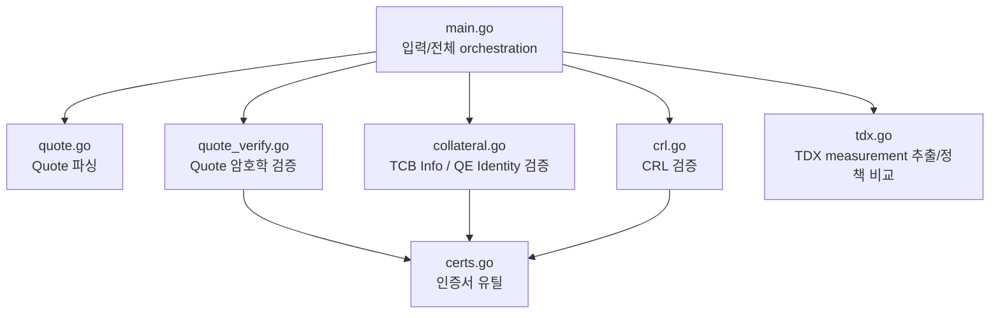
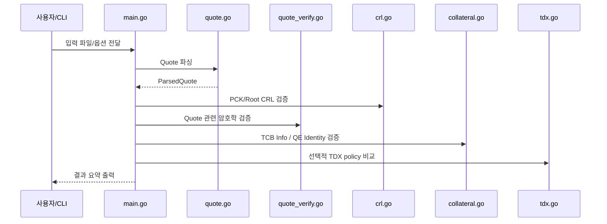

# 코드 구조와 파일별 역할

## 전체 구조

## 개요

이 저장소는 검증 단계를 책임별로 분리해 두었습니다.

## 파일별 역할

### `main.go`
프로그램의 진입점입니다.

- CLI 옵션 파싱
- 기본 경로 설정
- 전체 검증 순서 orchestration
- 최종 요약 출력

### `quote.go`
Quote 파싱 전용 파일입니다.

- Quote header/body 분리
- TDX/SGX body size 판별
- Quote signature / AK / QE report / certification data 추출

### `quote_verify.go`
Quote 암호학 검증 전용 파일입니다.

- PCK chain 검증
- QE report signature 검증
- AK binding 검증
- Quote signature 검증

### `tdx.go`
TDX measurement 추출 / 정책 비교 전용 파일입니다.

- TD report body에서 `MRTD`, `RTMR`, `REPORTDATA` 등 추출
- 사용자가 제공한 policy JSON과 exact match 비교

### `collateral.go`
Intel collateral(JSON) 검증 전용 파일입니다.

- TCB Info 검증
- QE Identity 검증
- FMSPC / PCEID / TCB level / TDX module policy 확인
- QE identity 정책 확인

### `crl.go`
CRL 검증 전용 파일입니다.

- PCK CRL 로드/서명 검증
- Root CA CRL 로드/서명 검증
- freshness 확인
- revocation 여부 확인

### `certs.go`
인증서 공통 유틸리티입니다.

- PEM cert 파싱
- 단일 cert 파싱
- cert chain 로드
- 공통 chain verify
- cert 출력

### `main_integration_test.go`
샘플 실행 회귀 테스트입니다.

- 샘플 검증 성공 테스트
- freshness 미완화 시 실패 테스트
- TDX policy 성공/실패 테스트

## 실행 흐름 요약

