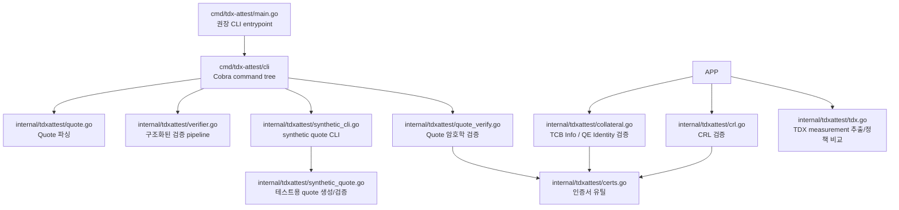

# 코드 구조와 파일별 역할

## 전체 구조

## 개요

이 저장소는 검증 단계를 책임별로 분리해 두었습니다.

## 파일별 역할

### `cmd/tdx-attest/main.go`
CLI entrypoint입니다.

- release/build 대상 command
- 루트 wrapper와 동일하게 `cmd/tdx-attest/cli.Execute` 호출

### `cmd/tdx-attest/cli/cli.go`
Cobra command tree와 command별 flag를 담당합니다.

- `verify` / `synthetic-root` / `synthetic-quote` subcommand routing
- subcommand 없는 legacy verify 경로 유지
- 기존 single-dash long flag 호환성 유지 (`-sample-time` 등)
- Cobra 의존성은 이 `cmd` 하위 패키지에만 존재

### `pkg/tdxattest/tdxattest.go`
외부 호출자가 사용할 수 있는 최소 non-CLI 공개 API입니다.

- `GenerateSyntheticRoot()`
- `GenerateSyntheticQuote()`
- `GenerateSyntheticQuoteWithRoot(...)`
- `VerifySyntheticQuoteCrypto(...)`
- internal 세부 타입이 공개 API에 새지 않도록 얇은 wrapper만 제공
- Cobra나 command wiring은 포함하지 않음

### `internal/tdxattest/app.go`
검증 실행 helper와 기본 config를 담당합니다.

- `DefaultConfig()`
- `RunVerify(config)`

### `internal/tdxattest/verifier.go`
기존 전체 검증 순서를 구조화된 요청/결과 API로 감싼 pipeline입니다.

- `VerificationRequest` / `VerificationResult`
- 기존 Intel collateral 검증 순서 실행
- CLI 출력은 유지하면서 테스트와 future API가 결과 구조체를 참조할 수 있게 함

### `internal/tdxattest/synthetic_quote.go`
Intel이 서명하지 않은 테스트용 synthetic quote 생성/로컬 검증 파일입니다.

- 테스트 root/intermediate/PCK leaf 생성
- QE report signature 생성
- AK binding용 `report_data[0:32]` 채우기
- attestation key로 quote header/body self-sign
- synthetic root 기반 로컬 암호학 검증

### `internal/tdxattest/synthetic_cli.go`
Synthetic quote 전용 CLI입니다.

- `synthetic-root`: reusable synthetic root key/cert 생성
- `synthetic-quote`: 기존 synthetic root로 synthetic quote 생성
- legacy `synthesize`: synthetic quote와 synthetic root cert를 한 번에 생성
- Intel collateral/CRL/TCB 정책 검증은 의도적으로 수행하지 않음

### `internal/tdxattest/quote.go`
Quote 파싱 전용 파일입니다.

- Quote header/body 분리
- TDX/SGX body size 판별
- Quote signature / AK / QE report / certification data 추출

### `internal/tdxattest/quote_verify.go`
Quote 암호학 검증 전용 파일입니다.

- PCK chain 검증
- QE report signature 검증
- AK binding 검증
- Quote signature 검증

### `internal/tdxattest/tdx.go`
TDX measurement 추출 / 정책 비교 전용 파일입니다.

- TD report body에서 `MRTD`, `RTMR`, `REPORTDATA` 등 추출
- 사용자가 제공한 policy JSON과 exact match 비교

### `internal/tdxattest/collateral.go`
Intel collateral(JSON) 검증 전용 파일입니다.

- TCB Info 검증
- QE Identity 검증
- FMSPC / PCEID / TCB level / TDX module policy 확인
- QE identity 정책 확인

### `internal/tdxattest/crl.go`
CRL 검증 전용 파일입니다.

- PCK CRL 로드/서명 검증
- Root CA CRL 로드/서명 검증
- freshness 확인
- revocation 여부 확인

### `internal/tdxattest/certs.go`
인증서 공통 유틸리티입니다.

- PEM cert 파싱
- 단일 cert 파싱
- cert chain 로드
- 공통 chain verify
- cert 출력

### `internal/tdxattest/*_test.go`
샘플 실행 회귀 테스트입니다.

- 샘플 검증 성공 테스트
- freshness 미완화 시 실패 테스트
- TDX policy 성공/실패 테스트

## 실행 흐름 요약

