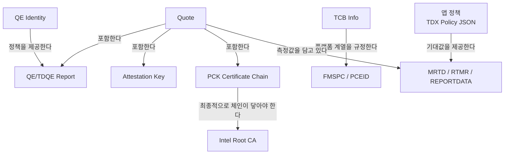

# 용어 정리

## 관계도

## 핵심 약어 먼저 보기

### PCK
**PCK = Provisioning Certification Key**

TDX/SGX 플랫폼에 대해 Intel이 발급하는 인증서입니다.
이 프로젝트에서는 Quote 안에 포함된 **PCK certificate chain**을 꺼내서,
그 인증서가 Intel Root CA까지 정상적으로 이어지는지 검증합니다.

쉽게 말하면,
> **"이 Quote를 만든 플랫폼이 Intel 인증 체계 안에 있는가"**
를 증명하는 출발점입니다.

### QE
**QE = Quoting Enclave**

SGX/TDX에서 Quote 생성을 담당하는 엔클레이브 또는 구성 요소를 말합니다.
Quote 안에는 QE report가 포함되며, 이 report는 PCK 인증서와 Quote 서명 사이를 이어주는 중간 증거입니다.

이 프로젝트에서는 QE report를 이용해 다음을 확인합니다.

- PCK leaf 공개키로 QE report 서명이 맞는지
- QE report의 `report_data`가 AK/auth data와 연결되는지
- QE Identity JSON이 설명하는 정책과 QE report가 맞는지

### TDQE
**TDQE = TDX용 Quoting Enclave / TDX Quote를 생성하는 QE 측 구성 요소**

문서나 구현에서는 QE와 TDQE를 구분해서 부르기도 하고, 함께 묶어서 설명하기도 합니다.
이 저장소에서는 `QE/TDQE`라는 표현을 같이 쓰는 이유가 여기에 있습니다.

즉,
- SGX 쪽 문맥에서는 QE
- TDX 쪽 문맥에서는 TDQE

로 이해하면 됩니다.

### TCB
**TCB = Trusted Computing Base**

플랫폼이 신뢰 가능한 상태인지 판단하는 데 필요한 하드웨어/펌웨어/소프트웨어 구성의 상태를 뜻합니다.
Intel은 TCB Info JSON에서 platform 계열별 TCB level을 공개합니다.

이 프로젝트에서는 다음을 사용해 TCB level을 맞춥니다.

- PCK cert 안의 SGX component SVN
- PCK cert 안의 PCESVN
- Quote 안의 `TEE_TCB_SVN`
- TCB Info JSON의 `tcbLevels`

즉,
> **"현재 플랫폼 상태가 Intel이 허용 가능한 수준으로 분류한 TCB level 중 하나를 만족하는가"**
를 확인합니다.

### PCE
**PCE = Provisioning Certification Enclave**

PCK 인증서 발급/프로비저닝 체계와 연결되는 구성 요소입니다.
TCB Info에는 `pceId`가 들어 있고, PCK cert 안에도 대응되는 PCE 정보가 들어 있습니다.

이 프로젝트에서는
- PCK cert의 `PCEID`
- TCB Info JSON의 `pceId`

가 일치하는지 확인합니다.

이 검사는
> **"이 collateral이 이 PCK cert 문맥과 맞는가"**
를 확인하는 보조 일관성 검증입니다.

### SVN / PCESVN
**SVN = Security Version Number**

특정 구성 요소의 보안/버전 수준을 나타내는 값입니다.
TCB level은 보통 여러 SVN 값의 임계치 조합으로 표현됩니다.

#### SGX component SVN
PCK cert 안에는 여러 SGX component SVN 값이 들어 있습니다.
이 값은 platform BIOS/microcode/구성요소 상태를 반영하는 데 사용됩니다.

#### PCESVN
**PCESVN = PCE Security Version Number**

PCE 자체의 보안 버전 수준을 뜻합니다.
TCB Info의 `tcbLevels`에는 `pcesvn`이 포함되어 있고,
현재 플랫폼의 PCK cert에서 추출한 `PCESVN`이 그 수준 이상인지 확인합니다.

즉,
- `SVN`: 각 구성 요소의 보안 버전
- `PCESVN`: PCE의 보안 버전

으로 이해하면 됩니다.

---

## 일반 용어 표

| 용어 | 의미 | 왜 중요한가 |
| --- | --- | --- |
| **Quote** | TDX/SGX가 생성한 attestation 결과물 | 검증 대상 본체입니다. |
| **PCK Certificate** | 플랫폼에 발급된 Intel 인증서 | Quote 검증 체인의 핵심 leaf certificate입니다. |
| **PCK Chain** | PCK leaf + intermediate(+ root) 인증서 체인 | Quote에 포함된 인증서가 Intel Root까지 이어지는지 확인합니다. |
| **QE / TDQE Report** | Quote 생성 엔클레이브/모듈에 대한 보고서 | Quote와 인증서 체인을 연결하는 중간 증거입니다. |
| **Attestation Key (AK)** | Quote 서명에 쓰이는 ephemeral key | Quote 본문 서명의 진위를 확인할 때 사용합니다. |
| **TCB Info** | Intel이 제공하는 플랫폼 TCB 상태 정보 JSON | 플랫폼 상태가 허용 가능한지 판정할 때 사용합니다. |
| **QE Identity** | QE/TDQE가 어떤 값이어야 하는지 설명하는 Intel JSON | QE의 `MRSIGNER`, `ISVSVN`, `miscselect`, `attributes` 등을 검증합니다. |
| **FMSPC** | 플랫폼/패키지 계열을 식별하는 값 | TCB Info가 이 PCK cert와 같은 플랫폼 계열용인지 확인합니다. |
| **PCEID** | Provisioning Certification Enclave 식별 값 | TCB Info와 PCK cert의 맥락이 맞는지 추가로 확인합니다. |
| **CRL** | Certificate Revocation List | 인증서가 폐기(revoked)되지 않았는지 확인합니다. |
| **TCB Level** | 특정 SVN/PCESVN 조합에 대한 Intel 상태 판정 | 플랫폼 상태가 `UpToDate`인지 등으로 이어집니다. |
| **MRTD / RTMR / REPORTDATA** | TD의 측정값/런타임 측정 레지스터/앱 바인딩 데이터 | 애플리케이션 정책과 연결되는 핵심 measurement입니다. |
| **Freshness** | collateral/CRL의 유효 기간 검사 | 오래되었거나 미래 시점의 collateral을 거절하기 위해 필요합니다. |
