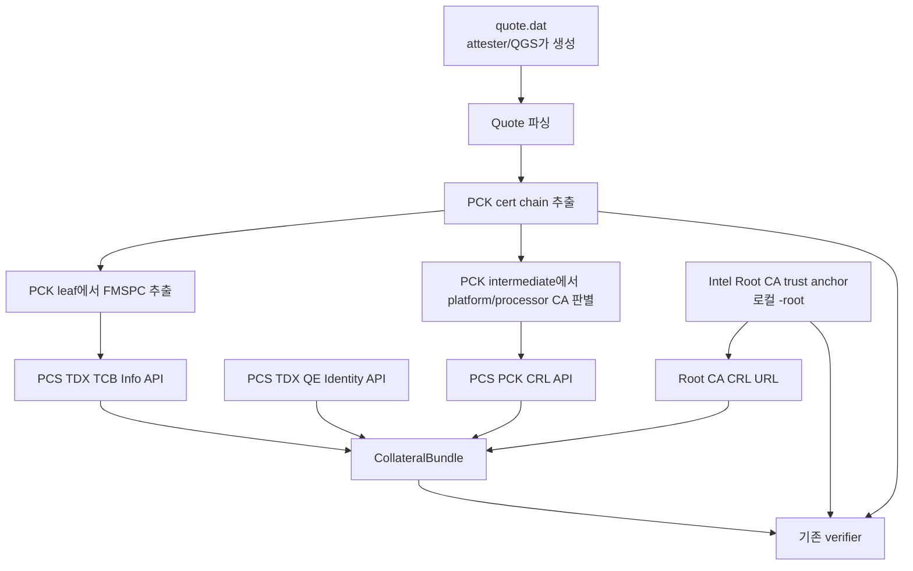

# Intel PCS API로 TDX quote collateral 가져오기

이 문서는 `test_data/`에 미리 내려받아 둔 collateral 대신 Intel PCS(Provisioning Certification Service)와 Intel 인증서 배포 URL에서 어떤 데이터를 가져올 수 있고, 이 코드베이스가 그 데이터를 어떻게 쓰는지 정리합니다.

> 요약: `quote.dat` 자체는 PCS에서 가져오는 데이터가 아닙니다. Quote는 attester/TDX guest/QGS가 생성한 evidence이고, PCS는 그 quote를 검증하는 데 필요한 collateral을 제공합니다.

## 현재 코드의 PCS 모드

```bash
go run ./cmd/tdx-attest verify \
  -quote test_data/quote.dat \
  -collateral-source pcs
```

선택 체크만 PCS collateral로 실행할 수도 있습니다.

```bash
go run ./cmd/tdx-attest verify \
  -quote test_data/quote.dat \
  -collateral-source pcs \
  -check pck-crl,root-crl \
  -ignore-freshness
```

관련 구현 위치:

- `internal/tdxattest/pcs.go`: PCS HTTP client와 `CollateralBundle` 구성
- `internal/tdxattest/verifier.go`: `-collateral-source pcs`일 때 PCS fetch 후 검증에 주입
- `internal/tdxattest/collateral.go`: TCB Info / QE Identity JSON 검증
- `internal/tdxattest/crl.go`: PCK CRL / Root CA CRL 검증
- `cmd/tdx-attest/cli/cli.go`: `-collateral-source`, `-pcs-base-url` 옵션

## API key 여부

이 코드가 사용하는 collateral 조회 경로는 API key를 보내지 않습니다.

검증에 필요한 아래 GET 요청들은 `Ocp-Apim-Subscription-Key` 없이 조회할 수 있습니다.

- TDX TCB Info
- TDX QE Identity
- PCK CRL
- Intel SGX Root CA CRL

주의할 점:

- Intel PCS/registration API 전체가 무인증이라는 뜻은 아닙니다.
- 플랫폼 등록, 일부 provisioning 관련 API, 운영 환경의 PCCS 배치 방식은 별도 인증/권한이 필요할 수 있습니다.
- 이 문서에서 “API key 없음”이라고 말하는 범위는 quote 검증 collateral 조회에 한정됩니다.

## 전체 데이터 흐름



중요한 신뢰 경계:

- quote 안의 PCK chain은 검증 대상이지 trust anchor가 아닙니다.
- `-root`로 제공한 Intel SGX Root CA만 trust anchor로 사용합니다.
- PCS 응답의 issuer chain은 `-root`까지 이어지는지 검증합니다.
- 네트워크에서 받은 root를 그대로 신뢰하지 않습니다.

## 가져올 수 있는 데이터와 사용처

| 데이터 | 현재 로컬 파일 | API/URL | 요청에 필요한 값 | 응답에서 쓰는 부분 | 코드 사용처 |
| --- | --- | --- | --- | --- | --- |
| TDX TCB Info | `test_data/collateral/tcbinfo.json` | `GET /tdx/certification/v4/tcb?fmspc=<FMSPC>` | PCK leaf cert의 FMSPC | JSON body, `TCB-Info-Issuer-Chain` header | TCB Info 서명, freshness, FMSPC/PCEID, TCB level, TDX module 정책 검증 |
| TDX QE Identity | `test_data/collateral/qeidentity.json` | `GET /tdx/certification/v4/qe/identity` | 없음. 선택적으로 `update`, `tcbEvaluationDataNumber` 가능 | JSON body, `SGX-Enclave-Identity-Issuer-Chain` header | QE/TDQE identity 서명, freshness, QE report 정책 검증 |
| PCK CRL | `test_data/certs/pck_platform_crl.der` | `GET /sgx/certification/v4/pckcrl?ca=platform&encoding=der` 또는 `ca=processor` | PCK intermediate가 Platform CA인지 Processor CA인지 | CRL body. issuer-chain header도 제공되지만 현재 검증은 quote의 intermediate 사용 | PCK leaf serial revocation, CRL signature/freshness 검증 |
| Root CA CRL | `test_data/certs/IntelSGXRootCA.crl` | `https://certificates.trustedservices.intel.com/IntelSGXRootCA.der` 또는 root cert의 CRL Distribution Point | 없음 | CRL body | PCK intermediate와 JSON signing cert revocation 검증 |
| TCB signing chain | `test_data/certs/tcbSigningChain.pem` | TDX TCB Info 응답 header `TCB-Info-Issuer-Chain` | TDX TCB Info 요청 성공 | URL-encoded PEM chain | TCB Info JSON signature verification |
| QE identity signing chain | `test_data/certs/tcbSigningChain.pem` | TDX QE Identity 응답 header `SGX-Enclave-Identity-Issuer-Chain` | TDX QE Identity 요청 성공 | URL-encoded PEM chain | QE Identity JSON signature verification |

## Endpoint 상세

기본 base URL:

```text
https://api.trustedservices.intel.com
```

이 코드에서는 테스트/프록시를 위해 `-pcs-base-url`로 바꿀 수 있습니다.

### 1. TDX TCB Info

```http
GET https://api.trustedservices.intel.com/tdx/certification/v4/tcb?fmspc=<12 hex chars>
```

예:

```bash
curl -D headers.txt \
  'https://api.trustedservices.intel.com/tdx/certification/v4/tcb?fmspc=00806F050000' \
  -o tcbinfo.json
```

요청 값:

- `fmspc`: PCK leaf certificate의 Intel SGX extension에서 추출한 6바이트 값입니다.
- hex string 12자입니다.

응답:

- Body: signed TDX TCB Info JSON
- Header: `TCB-Info-Issuer-Chain`
  - URL-encoded PEM chain
  - signing cert와 root cert를 포함합니다.

검증에 쓰는 방식:

1. issuer chain을 URL decode합니다.
2. TCB signing cert chain이 로컬 trust anchor `-root`까지 이어지는지 검증합니다.
3. Root CA CRL로 signing cert가 폐기되지 않았는지 확인합니다.
4. signing cert로 TCB Info JSON signature를 검증합니다.
5. TCB Info `issueDate` / `nextUpdate` freshness를 확인합니다.
6. PCK leaf의 FMSPC/PCEID와 TCB Info의 FMSPC/PCEID가 맞는지 확인합니다.
7. PCK cert의 SGX component SVN, PCESVN, quote의 `TEE_TCB_SVN`을 TCB levels와 비교합니다.
8. TDX module 관련 `MRSIGNERSEAM`, `SEAMATTRIBUTES` 정책 일부를 확인합니다.

현재 구현:

```go
tcbBody, tcbHeaders, err := c.get(ctx, c.endpoint("/tdx/certification/v4/tcb", map[string]string{"fmspc": fmspc}))
tcbChain, err := issuerChainFromHeaders(tcbHeaders, "TCB-Info-Issuer-Chain")
```

### 2. TDX QE Identity

```http
GET https://api.trustedservices.intel.com/tdx/certification/v4/qe/identity
```

예:

```bash
curl -D headers.txt \
  'https://api.trustedservices.intel.com/tdx/certification/v4/qe/identity' \
  -o qeidentity.json
```

응답:

- Body: signed TDX QE Identity JSON
- Header: `SGX-Enclave-Identity-Issuer-Chain`
  - 이름은 `SGX-...`이지만 TDX QE Identity 응답에도 이 header가 사용됩니다.
  - URL-encoded PEM chain입니다.

검증에 쓰는 방식:

1. issuer chain을 URL decode합니다.
2. QE identity signing cert chain이 로컬 trust anchor `-root`까지 이어지는지 검증합니다.
3. Root CA CRL로 signing cert가 폐기되지 않았는지 확인합니다.
4. signing cert로 QE Identity JSON signature를 검증합니다.
5. QE Identity `issueDate` / `nextUpdate` freshness를 확인합니다.
6. quote 안의 QE report와 identity 정책을 비교합니다.
   - `MRSIGNER`
   - `ISVPRODID`
   - `ISVSVN` TCB level
   - `MISCSELECT` mask
   - `ATTRIBUTES` mask

현재 구현:

```go
qeBody, qeHeaders, err := c.get(ctx, c.endpoint("/tdx/certification/v4/qe/identity", nil))
qeChain, err := issuerChainFromHeaders(qeHeaders, "SGX-Enclave-Identity-Issuer-Chain")
```

### 3. PCK CRL

```http
GET https://api.trustedservices.intel.com/sgx/certification/v4/pckcrl?ca=<platform|processor>&encoding=der
```

예:

```bash
curl \
  'https://api.trustedservices.intel.com/sgx/certification/v4/pckcrl?ca=platform&encoding=der' \
  -o pck_platform_crl.der
```

요청 값:

- `ca=platform`: quote의 PCK intermediate subject가 `Intel SGX PCK Platform CA`인 경우
- `ca=processor`: quote의 PCK intermediate subject가 `Intel SGX PCK Processor CA`인 경우
- `encoding=der`: DER CRL로 받습니다. `pem`도 가능하지만 현재 구현은 DER로 요청합니다.

응답:

- Body: PCK Platform/Processor CA CRL
- Header: `SGX-PCK-CRL-Issuer-Chain`
  - Intel 문서상 제공됩니다.
  - 현재 구현은 quote에 들어 있는 PCK intermediate를 issuer로 사용해 CRL signature를 확인하므로 이 header는 저장하지 않습니다.

검증에 쓰는 방식:

1. CRL signature가 PCK intermediate로 검증되는지 확인합니다.
2. CRL `thisUpdate` / `nextUpdate` freshness를 확인합니다.
3. PCK leaf serial이 CRL에 올라와 있지 않은지 확인합니다.

현재 구현:

```go
pckCRL, _, err := c.get(ctx, c.endpoint("/sgx/certification/v4/pckcrl", map[string]string{"ca": pckCA, "encoding": "der"}))
```

### 4. Root CA CRL

```text
https://certificates.trustedservices.intel.com/IntelSGXRootCA.der
```

또는 root certificate의 CRL Distribution Point를 사용합니다.

예:

```bash
curl \
  'https://certificates.trustedservices.intel.com/IntelSGXRootCA.der' \
  -o IntelSGXRootCA.der
```

응답:

- Body: Intel SGX Root CA CRL

검증에 쓰는 방식:

1. CRL signature가 로컬 trust anchor `-root`로 검증되는지 확인합니다.
2. CRL freshness를 확인합니다.
3. 다음 인증서들이 Root CA CRL에 의해 폐기되지 않았는지 확인합니다.
   - PCK intermediate
   - TCB Info signing cert
   - QE Identity signing cert

현재 구현:

```go
rootCRLURL := c.RootCRLURL
if rootCRLURL == "" {
    rootCRLURL = rootCRLDistributionPoint(rootCert)
}
rootCRL, _, err := c.get(ctx, rootCRLURL)
```

## CollateralBundle 필드와 의미

`internal/tdxattest/pcs.go`의 `CollateralBundle`은 파일 경로 대신 검증에 필요한 원본 bytes를 담습니다.

```go
type CollateralBundle struct {
    TCBInfoJSON        []byte
    TCBSigningChainPEM []byte
    QEIdentityJSON     []byte
    QEIdentityChainPEM []byte
    PCKCRL             []byte
    RootCRL            []byte
}
```

각 필드의 출처:

| 필드 | 출처 |
| --- | --- |
| `TCBInfoJSON` | TDX TCB Info API body |
| `TCBSigningChainPEM` | TDX TCB Info API `TCB-Info-Issuer-Chain` header |
| `QEIdentityJSON` | TDX QE Identity API body |
| `QEIdentityChainPEM` | TDX QE Identity API `SGX-Enclave-Identity-Issuer-Chain` header |
| `PCKCRL` | PCK CRL API body |
| `RootCRL` | Intel SGX Root CA CRL URL body |

이 구조 덕분에 verifier는 같은 검증 로직을 두 출처에 재사용합니다.

- `local`: `test_data/...` 파일을 읽어서 검증
- `pcs`: 네트워크에서 받은 bytes를 `CollateralBundle`로 넣어서 검증

## API 응답을 그대로 신뢰하면 안 되는 이유

PCS에서 받은 값은 모두 검증 대상입니다.

- TCB Info / QE Identity JSON은 signature를 확인해야 합니다.
- JSON signing cert chain은 로컬 root까지 이어지는지 확인해야 합니다.
- PCK CRL / Root CRL은 signature와 freshness를 확인해야 합니다.
- PCK leaf와 TCB Info의 FMSPC/PCEID가 일치해야 합니다.

즉, HTTPS로 받아왔다는 사실만으로 collateral을 신뢰하지 않습니다. 이 코드가 수행하는 핵심은 “받아온 collateral이 Intel trust chain과 quote의 PCK/TDX 값에 맞는지”를 검증하는 것입니다.

## Quote에서 이미 들어 있는 것과 PCS에서 가져오는 것

Quote 안에 이미 들어 있는 것:

- Quote header/body
- TD report body
- quote signature
- attestation key
- QE/TDQE report
- QE/TDQE report signature
- QE auth data
- PCK certificate chain

PCS에서 가져오는 것:

- TCB Info JSON
- QE Identity JSON
- PCK CRL
- Root CA CRL
- JSON signing cert chains

현재 코드에서는 quote 안의 PCK chain을 기준으로 FMSPC와 PCK CRL CA를 결정합니다. 따라서 일반적인 DCAP quote처럼 PCK chain이 quote certification data에 들어 있는 경우, 별도의 PCK certificate 조회 API는 필요하지 않습니다.

## 샘플 quote와 최신 PCS collateral의 차이

`test_data/quote.dat`는 과거 샘플 quote입니다. 최신 PCS collateral로 전체 검증을 수행하면 다음 이유로 실패할 수 있습니다.

- TCB Info나 QE Identity의 `issueDate` / `nextUpdate` 시점이 quote 샘플 시점과 다름
- 최신 TCB Info에서 샘플 플랫폼의 TCB status가 더 이상 acceptable하지 않을 수 있음
- Root/PCK CRL freshness가 현재 시점 기준으로만 의미 있음

학습/샘플 재현은 로컬 `test_data`와 `-sample-time`, `-ignore-freshness`를 쓰는 편이 안정적입니다. 네트워크 fetch 자체와 CRL 경로를 확인하려면 `-check pck-crl,root-crl`처럼 범위를 좁히면 됩니다.

## 운영 환경에서의 권장 방식

- `quote.dat`에 해당하는 quote는 attester에서 최신으로 받아옵니다.
- root CA trust anchor는 로컬에 pinning합니다.
- PCS collateral은 quote의 PCK/FMSPC에 맞춰 fetch합니다.
- freshness 검사는 끄지 않습니다.
- `REPORTDATA` challenge/session binding은 애플리케이션 프로토콜에서 별도로 확인합니다.
- `MRTD`, `RTMR`, `TDATTRIBUTES`, `XFAM` 등 워크로드 정책은 `-tdx-policy` 같은 별도 allow policy로 검증합니다.

## 참고 자료

- Intel PCS API 문서: https://api.portal.trustedservices.intel.com/content/documentation.html
- Intel SGX/TDX PCCS API 문서: https://cc-enabling.trustedservices.intel.com/intel-sgx-tdx-pccs/03/api_specification_for_pccs/
- Intel Root CA / CRL 배포: https://certificates.trustedservices.intel.com/IntelSGXRootCA.der
