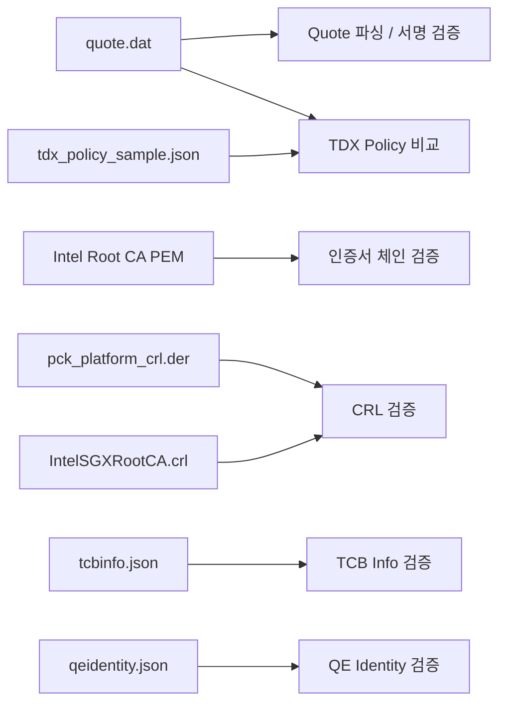

# 샘플 데이터 설명

샘플 데이터는 모두 `test_data/` 아래에 있습니다.

## 샘플 데이터가 검증 흐름에 들어가는 방식



## 디렉터리 구조

```text
test_data/
├── quote.dat
├── tdx_policy_sample.json
├── certs/
│   ├── Intel_SGX_Provisioning_Certification_RootCA.pem
│   ├── IntelSGXRootCA.crl
│   ├── pckCrlSigningChain.pem
│   ├── pck_platform_crl.der
│   └── tcbSigningChain.pem
└── collateral/
    ├── qeidentity.json
    └── tcbinfo.json
```

## 파일별 설명

| 파일 | 형식 | 들어 있는 정보 | 코드에서 어디에 쓰이는가 | 왜 필요한가 | 출처 |
| --- | --- | --- | --- | --- | --- |
| `test_data/quote.dat` | 바이너리 TDX Quote | Quote header/body, QE report, Quote signature, AK, certification data(PCK chain) | `quote.go`, `quote_verify.go`, `tdx.go` | 검증 대상 본체입니다. | Edgeless Systems `go-tdx-qpl`의 예제 Quote. 저장소 설명상 Intel TDX 개발 플랫폼에서 생성된 예제입니다: https://github.com/edgelesssys/go-tdx-qpl/blob/main/blobs/blobs.go |
| `test_data/certs/Intel_SGX_Provisioning_Certification_RootCA.pem` | PEM certificate | Intel Root CA cert | `main.go`, `certs.go` | 모든 certificate/signing chain의 trust anchor입니다. | Intel 공식 Root CA 인증서 배포 URL(동일 인증서의 DER 원본): https://certificates.trustedservices.intel.com/IntelSGXRootCA.der |
| `test_data/certs/pck_platform_crl.der` | DER CRL | Platform CA가 발급한 PCK revocation list | `crl.go` | PCK leaf가 폐기되지 않았는지 확인합니다. | Intel PCS PCK CRL 엔드포인트에서 다운로드: https://api.trustedservices.intel.com/sgx/certification/v4/pckcrl?ca=platform&encoding=der |
| `test_data/certs/IntelSGXRootCA.crl` | PEM X509 CRL | Root CA가 발급한 intermediate/signing cert revocation list | `crl.go` | intermediate와 signing cert가 폐기되지 않았는지 확인합니다. | Intel 공식 CRL 배포 URL: https://certificates.trustedservices.intel.com/IntelSGXRootCA.crl |
| `test_data/certs/tcbSigningChain.pem` | PEM certificate chain | TCB Info / QE Identity JSON 서명 cert chain | `collateral.go`, `certs.go` | JSON 서명이 Intel signing cert로 만들어졌는지 확인합니다. | Edgeless Systems `go-tdx-qpl` 샘플 블롭 파일: https://github.com/edgelesssys/go-tdx-qpl/blob/main/blobs/tcbSigningChain.pem |
| `test_data/certs/pckCrlSigningChain.pem` | PEM certificate chain | PCK CRL 관련 참고용 cert chain | 현재 직접 사용하지 않음 | 추가 확장/비교 시 참고할 수 있습니다. | Edgeless Systems `go-tdx-qpl` 샘플 블롭 파일: https://github.com/edgelesssys/go-tdx-qpl/blob/main/blobs/pckCrlSigningChain.pem |
| `test_data/collateral/tcbinfo.json` | 서명된 JSON | FMSPC, PCEID, TCB levels, `tdxModule` 정책 | `collateral.go` | 플랫폼 TCB 상태와 TDX module 정책을 검증합니다. | Edgeless Systems `go-tdx-qpl` 샘플 파일(내용은 Intel PCS 응답 기반): https://github.com/edgelesssys/go-tdx-qpl/blob/main/blobs/tcbinfo.json |
| `test_data/collateral/qeidentity.json` | 서명된 JSON | QE identity 정책 (`miscselect`, `attributes`, `MRSIGNER`, `ISVSVN` 등) | `collateral.go` | QE report가 Intel이 기대하는 QE 특성과 맞는지 확인합니다. | Edgeless Systems `go-tdx-qpl` 샘플 파일(내용은 Intel PCS 응답 기반): https://github.com/edgelesssys/go-tdx-qpl/blob/main/blobs/qeidentity.json |
| `test_data/tdx_policy_sample.json` | 사용자 정책 JSON | 샘플 Quote에서 추출한 `MRTD`, `RTMR`, `REPORTDATA`, `TDATTRIBUTES`, `XFAM` 기대값 | `tdx.go` | 앱/서비스가 기대하는 TD measurement와 Quote가 맞는지 비교합니다. | 외부 배포물이 아니라 이 저장소에서 `test_data/quote.dat`의 실제 측정값을 읽어 만든 파생 샘플입니다. |


## 파일 형식이 서로 다른 이유

- `quote.dat`는 플랫폼/TD가 만든 raw binary evidence이므로 바이너리입니다.
- `*.pem`은 인증서/체인이므로 X.509 PEM입니다.
- `*.crl`, `*.der`는 폐기 목록이므로 X.509 CRL 형식입니다.
- `tcbinfo.json`, `qeidentity.json`은 Intel이 배포하는 서명된 structured collateral이라 JSON입니다.
- `tdx_policy_sample.json`은 Intel collateral이 아니라 사용자가 기대값을 넣는 정책 파일입니다.

## 샘플 실행에 `-sample-time` / `-ignore-freshness`가 필요한 이유

샘플 collateral은 과거 시점 기준 데이터입니다. 따라서 현재 날짜로 검증하면 아래에서 실패할 수 있습니다.

- TCB Info `issueDate` / `nextUpdate`
- QE Identity `issueDate` / `nextUpdate`
- CRL `thisUpdate` / `nextUpdate`

그래서 샘플 재현용으로는 보통 아래 옵션을 사용합니다.

- `-sample-time 2023-02-01T00:00:00Z`
- `-ignore-freshness`


## 출처를 읽을 때 주의할 점

- `quote.dat`, `tcbinfo.json`, `qeidentity.json`, `tcbSigningChain.pem`, `pckCrlSigningChain.pem`은 **Edgeless Systems의 공개 예제 저장소**에서 가져온 샘플 계열입니다.
- 그중 `tcbinfo.json`, `qeidentity.json`은 파일 내용 자체가 **Intel PCS 응답 형식**을 따릅니다.
- `pck_platform_crl.der`, `IntelSGXRootCA.crl`, Root CA cert는 **Intel 공식 배포 URL**을 직접 기준으로 삼는 편이 가장 정확합니다.
- `tdx_policy_sample.json`은 외부에서 받은 원본 파일이 아니라, 샘플 Quote의 실제 측정값을 보기 좋은 정책 입력 형식으로 **이 저장소에서 파생 생성한 파일**입니다.
