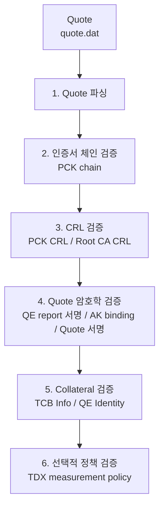
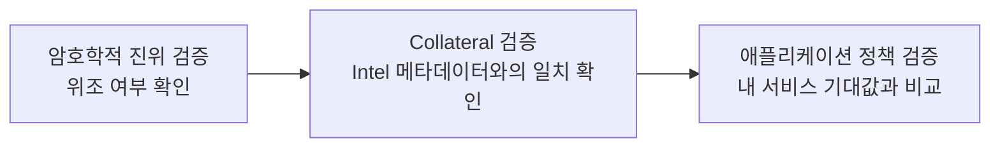

# 검증 개요

## 큰 흐름 한눈에 보기

## 이 프로젝트가 답하려는 질문

이 프로그램은 다음 질문에 답합니다.

> 이 TDX Quote가 Intel이 서명한 인증서/Collateral과 논리적으로 연결되고, 필요하면 사용자가 기대하는 TDX 측정값과도 맞는가?

이를 위해 검증을 세 층으로 나눕니다.

## 검증 층 구조

## 1. 암호학적 진위 검증

이 단계는 **"위조되지 않았는가"**를 확인합니다.

- PCK certificate chain 검증
- PCK leaf로 QE/TDQE report 서명 검증
- QE report의 `report_data`와 AK/auth data binding 확인
- AK로 Quote signature 검증

이 검증이 필요한 이유는, Quote처럼 보이는 바이트열이 진짜 TDX/SGX 생성 결과인지 판별하기 위해서입니다.

## 2. Collateral 검증

이 단계는 **"Intel이 이 플랫폼/QE를 어떻게 평가하는가"**를 확인합니다.

- TCB Info JSON 서명 검증
- QE Identity JSON 서명 검증
- signing certificate chain 검증
- CRL 검증
- freshness 검사
- FMSPC / PCEID / TCB level / QE identity 매칭

암호학적 서명이 맞더라도 아래 경우는 신뢰하면 안 됩니다.

- 폐기된 인증서
- 오래된 collateral
- 다른 플랫폼 계열용 collateral

## 3. 애플리케이션 정책 검증

이 단계는 **"우리 서비스가 기대하는 TD인가"**를 확인합니다.

- `MRTD`, `RTMR0~3`, `REPORTDATA`, `TDATTRIBUTES`, `XFAM` 비교
- 필요 시 `REPORTDATA`에 nonce/public key hash/challenge가 들어 있는지 확인

이 저장소는 이 단계 중 **정적 비교 가능한 부분**을 구현합니다. 
즉, `-tdx-policy` JSON을 주면 샘플 Quote의 측정값과 exact match 비교를 수행합니다.

## 현재 코드가 실제로 하는 일

1. Quote 파싱
2. PCK chain 검증
3. PCK CRL 검증
4. Root CA CRL 검증
5. QE/TDQE report signature 검증
6. AK binding 검증
7. Quote signature 검증
8. TCB Info 검증
9. QE Identity 검증
10. 선택적 TDX measurement policy 검증

## 아직 하지 않는 일

- `REPORTDATA` challenge / session binding
- 앱 정책 없이 measurement를 자동 allow/deny 하는 기능
- QE/TDQE identity의 더 세부적인 정책 엔진 수준 판정
- 현재 threshold matching보다 더 풍부한 TCB nuance 평가
