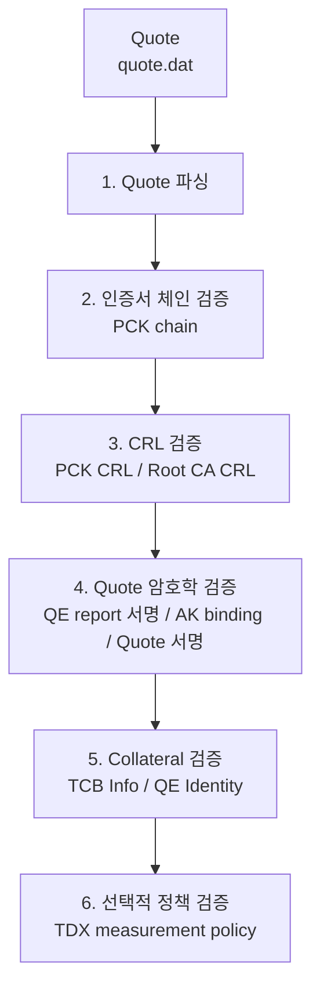
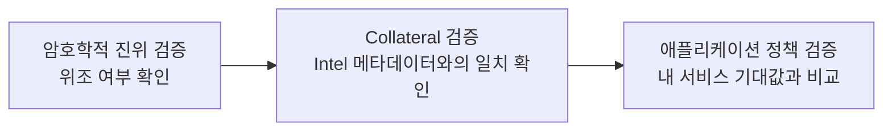
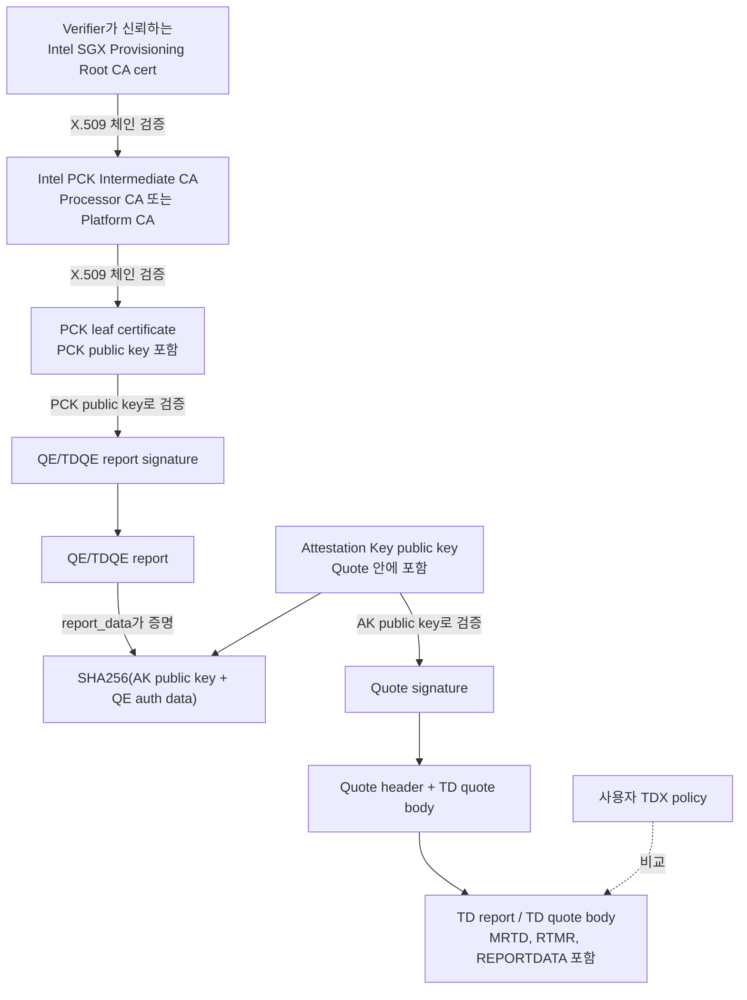
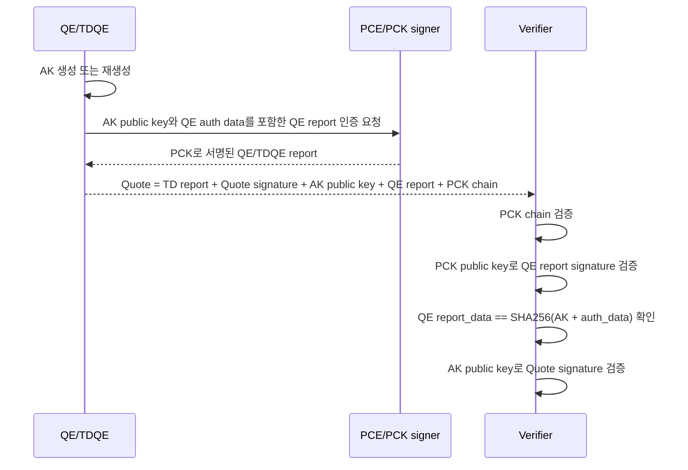
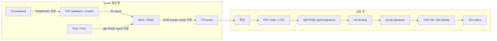

# 검증 개요

## 큰 흐름 한눈에 보기



## 이 프로젝트가 답하려는 질문

이 프로그램은 다음 질문에 답합니다.

> 이 TDX Quote가 Intel이 서명한 인증서/Collateral과 논리적으로 연결되고, 필요하면 사용자가 기대하는 TDX 측정값과도 맞는가?

이를 위해 검증을 세 층으로 나눕니다.

## 검증 층 구조



## 핵심 객체와 서명 체인 한눈에 보기

TDX Quote 검증에서 헷갈리기 쉬운 지점은 **서명이 하나가 아니라 여러 개**라는 점입니다.
Root key가 Quote 본문을 직접 서명하지 않습니다. 대신 아래처럼 단계적으로 신뢰가 이어집니다.



검증자가 실제로 확인하는 논리는 다음과 같습니다.

1. **Root CA → Intermediate CA → PCK leaf**: Quote 안에 들어 있는 PCK certificate chain이, 사용자가 별도로 제공한 Intel Root CA까지 이어지는지 확인합니다.
2. **PCK leaf → QE/TDQE report**: PCK leaf 공개키로 QE/TDQE report signature를 검증합니다.
3. **QE/TDQE report → AK**: QE/TDQE report의 `report_data`가 `SHA256(AK public key || QE auth data)`와 맞는지 확인합니다. 이 단계가 PCK 체인과 AK를 묶습니다.
4. **AK → TD Quote**: AK 공개키로 Quote signature를 검증합니다. 이 서명은 Quote header와 TD quote body를 덮습니다.
5. **TD quote body → 앱 정책**: `MRTD`, `RTMR0~3`, `REPORTDATA` 같은 TD 측정값을 서비스가 기대하는 값과 비교합니다.

즉 신뢰 경로는 짧게 쓰면 아래와 같습니다.

```text
Trusted Intel Root CA
  -> Intel PCK Intermediate CA
  -> PCK leaf certificate / PCK public key
  -> QE/TDQE report signature
  -> AK binding in QE/TDQE report_data
  -> Quote signature by AK
  -> TD report measurements and REPORTDATA
```

## 각 객체의 형식과 역할

### 1. Root key / Root CA certificate

여기서 말하는 root key는 보통 검증자가 파일로 들고 있는 **Root CA 인증서의 공개키**를 뜻합니다.
Root CA의 private key는 Intel 쪽에서만 관리되어야 하며, verifier는 private key를 절대 필요로 하지 않습니다.

이 저장소에서는 `-root`로 전달되는 파일이 trust anchor입니다.
기본 샘플은 `test_data/certs/Intel_SGX_Provisioning_Certification_RootCA.pem`을 사용합니다.
Quote 안에 Root CA cert가 같이 들어 있더라도, 코드는 그것을 그대로 신뢰하지 않고 **호출자가 명시한 root cert**를 기준으로 체인을 검증합니다.

역할:

- PCK intermediate CA 인증서가 Intel이 발급한 것인지 검증하는 출발점입니다.
- PCK leaf나 Quote body를 직접 검증하지 않습니다.
- Root CA CRL을 통해 root가 발급한 intermediate/signing certificate의 폐기 여부도 확인합니다.

### 2. PCK chain

PCK는 **Provisioning Certification Key**입니다.
PCK certificate chain은 Quote의 certification data 안에 PEM 인증서 묶음으로 들어 있습니다.
TDX Quote v4/v5의 일반적인 구조에서는 `Certification Data Type = 5`가 concatenated PCK cert chain을 나타냅니다.

일반적인 순서:

```text
PCK leaf certificate
  || Intel PCK Intermediate CA certificate
  || Intel Root CA certificate
```

의미:

- **PCK leaf certificate**에는 PCK public key가 들어 있습니다.
- PCK public key는 QE/TDQE report signature 검증에 사용됩니다.
- leaf 인증서는 플랫폼/패키지, 하드웨어 TCB, PCE SVN 같은 프로비저닝 문맥과 묶여 있습니다.
- intermediate는 Processor CA 또는 Platform CA일 수 있으며, 이 프로젝트는 leaf가 제공된 intermediate와 사용자가 제공한 root로 검증 가능한지만 확인합니다.

주의할 점:

- PCK chain은 **Quote를 만든 플랫폼이 Intel 인증 체계 안에 있는지** 확인하는 체인입니다.
- PCK leaf가 Quote body를 직접 서명하는 것은 아닙니다.
- PCK leaf는 QE/TDQE report를 검증하고, QE/TDQE report가 AK를 바인딩합니다. 그 AK가 Quote body를 서명합니다.
- 체인이 맞아도 PCK CRL에 leaf serial이 있으면 신뢰하면 안 됩니다.

### 3. Attestation Key (AK)

AK는 QE/TDQE가 Quote를 서명할 때 사용하는 ECDSA P-256 attestation key입니다.
Quote에는 AK private key가 아니라 **AK public key**가 들어 있습니다.

이 저장소가 다루는 AK public key 형식:

```text
64 bytes = X coordinate 32 bytes || Y coordinate 32 bytes
curve    = NIST P-256 / secp256r1
```

AK와 PCK chain이 연결되는 방식:



핵심은 **AK public key 자체를 그냥 믿지 않는다는 것**입니다.
Quote 안에 아무 public key나 넣고 서명한 위조 Quote를 막기 위해, QE/TDQE report의 `report_data`가 AK와 `auth_data`의 해시를 담고 있고 그 report가 PCK로 서명되어 있어야 합니다.

### 4. TD report / TD quote body

TD report는 TD가 TDX 하드웨어를 통해 얻는 로컬 보고서이고, TD quote body는 이 보고서가 원격 검증 가능한 Quote 안에 들어간 형태로 이해할 수 있습니다.
이 저장소의 TDX Quote 파서는 TD quote body를 584바이트 report body로 다룹니다.

주요 필드:

| 필드 | 크기 | 의미 | 이 프로젝트에서의 사용 |
| --- | ---: | --- | --- |
| `TEE_TCB_SVN` | 16B | TD가 실행된 TDX TCB SVN | TCB Info의 TDX component SVN과 비교 |
| `MRSEAM` | 48B | TDX Module 측정값 | TCB Info `tdxModule` 정책/사용자 정책과 비교 |
| `MRSIGNERSEAM` | 48B | TDX Module signer 측정값 | TCB Info `tdxModule` 정책/사용자 정책과 비교 |
| `SEAMATTRIBUTES` | 8B | SEAM 속성 | TCB Info `tdxModule` 정책/사용자 정책과 비교 |
| `TDATTRIBUTES` | 8B | TD 속성, 예: debug 관련 속성 | 사용자 정책과 비교 |
| `XFAM` | 8B | TD에 허용된 확장 기능 마스크 | 사용자 정책과 비교 |
| `MRTD` | 48B | TD 초기 내용 측정값 | golden measurement와 비교 |
| `MRCONFIGID` | 48B | TD 비소유자 구성 ID | 사용자 정책과 비교 |
| `MROWNER` | 48B | TD owner ID | 사용자 정책과 비교 |
| `MROWNERCONFIG` | 48B | owner-defined 구성 ID | 사용자 정책과 비교 |
| `RTMR0~3` | 각 48B | 런타임 확장 측정 레지스터 | 부팅/커널/런타임/워크로드 측정값과 비교 |
| `REPORTDATA` | 64B | TD가 verifier에게 바인딩하고 싶은 사용자 데이터 | nonce, public key hash, challenge 등과 비교 가능 |

중요한 구분:

- Intel collateral은 플랫폼/QE/TDX TCB가 어떤 상태인지 판단하는 자료입니다.
- `MRTD`, `RTMR`, `REPORTDATA`가 **내 서비스가 기대하는 워크로드인지**는 verifier가 별도 정책으로 판단해야 합니다.
- 그래서 이 저장소는 `-tdx-policy` JSON이 주어진 경우에만 measurement exact match를 수행합니다.

### 5. TD Quote

TD Quote는 원격 검증자가 받을 최종 attestation evidence입니다.
TDX DCAP Quote 형식에서 이 저장소가 사용하는 핵심 레이아웃은 다음과 같습니다.

```text
TD Quote
├─ Quote Header                         48 bytes
├─ TD Quote Body / TD Report Body       584 bytes
├─ Quote Signature Data Length           4 bytes
└─ Quote Signature Data               variable
   ├─ Quote Signature                   64 bytes  ECDSA P-256 r || s
   ├─ ECDSA Attestation Public Key      64 bytes  x || y
   └─ QE Certification Data           variable
      ├─ Certification Data Type         2 bytes  보통 6 = QE Report Certification Data
      ├─ Certification Data Size         4 bytes
      └─ QE Report Certification Data
         ├─ QE/TDQE Report             384 bytes
         ├─ QE/TDQE Report Signature    64 bytes  PCK로 서명
         ├─ QE Authentication Data    variable
         └─ Inner Certification Data
            ├─ Certification Data Type   2 bytes  5 = PCK Cert Chain
            ├─ Certification Data Size   4 bytes
            └─ PCK Cert Chain          variable  PEM bundle
```

Quote signature가 보호하는 범위:

```text
ECDSA_verify(
  public_key = AK public key,
  message    = Quote Header || TD Quote Body,
  signature  = Quote Signature,
)
```

따라서 Quote signature가 맞으면 TD quote body의 measurement와 `REPORTDATA`가 AK에 의해 보호됩니다.
그리고 AK가 QE/TDQE report 안에서 PCK로 인증되어 있으므로, 최종적으로는 Intel Root CA까지 이어지는 신뢰 사슬을 만들 수 있습니다.

## 생성 흐름과 검증 흐름 비교

생성 시에는 TD, TDX module, QGS/TDQE, PCE가 협력합니다. 검증자는 이 과정을 직접 본 것이 아니므로 Quote 안의 증거를 역순으로 확인합니다.



## 1. 암호학적 진위 검증

이 단계는 **"위조되지 않았는가"**를 확인합니다.

- PCK certificate chain 검증
- PCK leaf로 QE/TDQE report 서명 검증
- QE report의 `report_data`와 AK/auth data binding 확인
- AK로 Quote signature 검증

이 검증이 필요한 이유는, Quote처럼 보이는 바이트열이 진짜 TDX/SGX 생성 결과인지 판별하기 위해서입니다.

## 2. Collateral 검증

이 단계는 **"Intel이 이 플랫폼/QE를 어떻게 평가하는가"**를 확인합니다.

- TCB Info JSON 서명 검증
- QE Identity JSON 서명 검증
- signing certificate chain 검증
- CRL 검증
- freshness 검사
- FMSPC / PCEID / TCB level / QE identity 매칭

암호학적 서명이 맞더라도 아래 경우는 신뢰하면 안 됩니다.

- 폐기된 인증서
- 오래된 collateral
- 다른 플랫폼 계열용 collateral

## 3. 애플리케이션 정책 검증

이 단계는 **"우리 서비스가 기대하는 TD인가"**를 확인합니다.

- `MRTD`, `RTMR0~3`, `REPORTDATA`, `TDATTRIBUTES`, `XFAM` 비교
- 필요 시 `REPORTDATA`에 nonce/public key hash/challenge가 들어 있는지 확인

이 저장소는 이 단계 중 **정적 비교 가능한 부분**을 구현합니다.
즉, `-tdx-policy` JSON을 주면 샘플 Quote의 측정값과 exact match 비교를 수행합니다.

## 현재 코드가 실제로 하는 일

1. Quote 파싱
2. PCK chain 검증
3. PCK CRL 검증
4. Root CA CRL 검증
5. QE/TDQE report signature 검증
6. AK binding 검증
7. Quote signature 검증
8. TCB Info 검증
9. QE Identity 검증
10. 선택적 TDX measurement policy 검증

## 아직 하지 않는 일

- `REPORTDATA` challenge / session binding
- 앱 정책 없이 measurement를 자동 allow/deny 하는 기능
- QE/TDQE identity의 더 세부적인 정책 엔진 수준 판정
- 현재 threshold matching보다 더 풍부한 TCB nuance 평가

## 참고 자료

- Intel TDX Enabling Guide - Infrastructure Setup: https://cc-enabling.trustedservices.intel.com/intel-tdx-enabling-guide/02/infrastructure_setup/
- Intel TDX DCAP Quote Library API: https://download.01.org/intel-sgx/latest/dcap-latest/linux/docs/Intel_TDX_DCAP_Quoting_Library_API.pdf
- Intel SGX DCAP ECDSA Quote Library API: https://download.01.org/intel-sgx/latest/dcap-latest/linux/docs/Intel_SGX_ECDSA_QuoteLibReference_DCAP_API.pdf
- Intel Provisioning Certification Service: https://api.portal.trustedservices.intel.com/provisioning-certification
